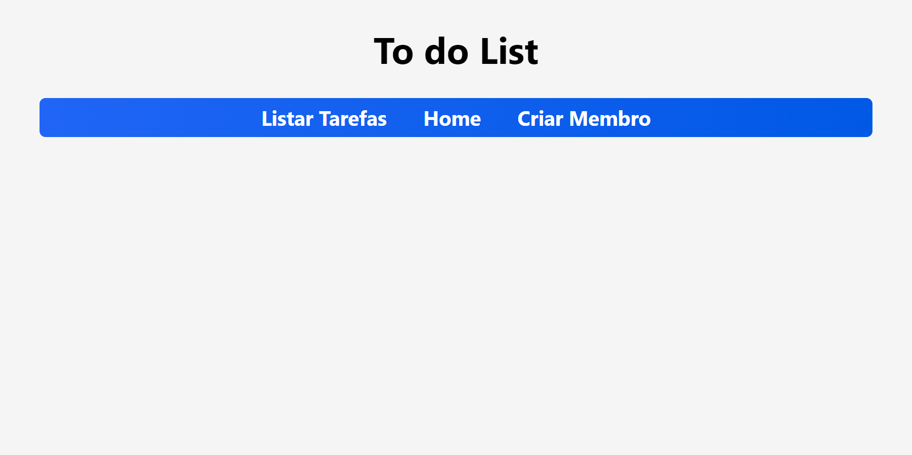
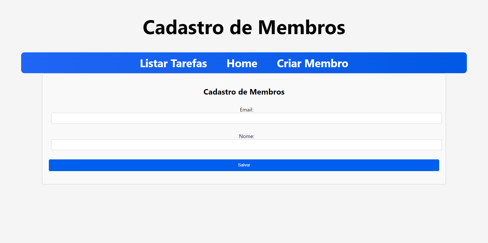
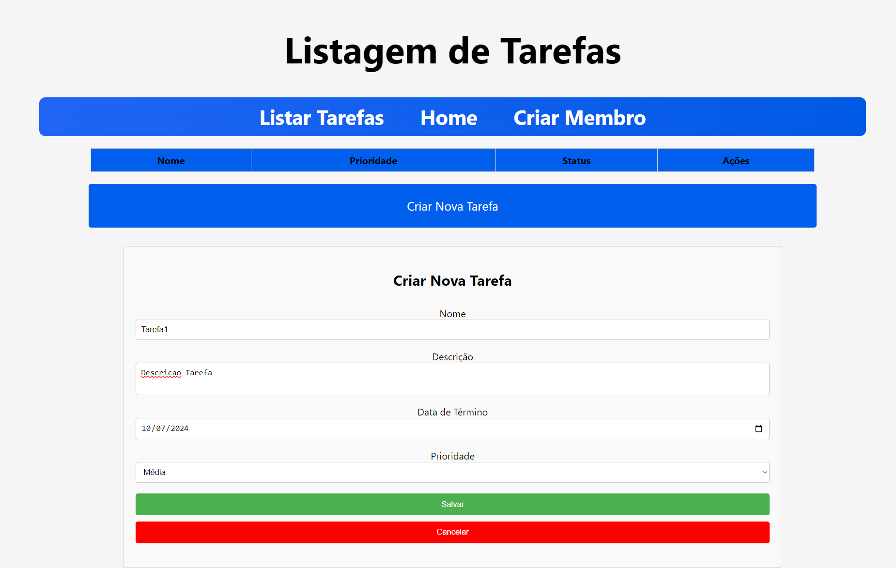

# To Do List Application

## Descrição do Projeto

Este projeto é uma aplicação web chamada "To Do List". A aplicação permite que os usuários cadastrem e gerenciem suas tarefas, seguindo as regras de negócio e exigências especificadas.

## Tecnologias Utilizadas

- **Back-end:** Node.JS com o framework Nest.JS
- **Front-end:** HTML, CSS, Javascript com o framework React.JS
- **Banco de Dados:** MySQL

## Funcionalidades Implementadas

### Tarefas

- **Atributos:**
  - **id:** Identificador único
  - **nome:** Nome da tarefa (Obrigatório, mínimo 5 caracteres, máximo 50 caracteres)
  - **descrição:** Descrição da tarefa (Máximo 140 caracteres)
  - **finalizada:** Indica se a tarefa foi concluída (Obrigatório, valores possíveis: True ou False)
  - **data de término:** Data e hora de conclusão da tarefa (Registrado automaticamente quando finalizada)
  - **prioridade:** Prioridade da tarefa (Obrigatório, valores possíveis: 'Baixa', 'Média', 'Alta', valor padrão: 'Baixa')

### Membros

- **Atributos:**
  - **id:** Identificador único
  - **email:** E-mail do membro (Obrigatório, único)
  - **nome:** Nome do membro (Obrigatório, mínimo 5 caracteres)

### Regras de Negócio

1. Toda tarefa pertence somente a um membro.
2. Um membro pode criar quantas tarefas desejar.
3. Tarefas finalizadas não podem ser editadas.
4. Validações devem ser satisfeitas antes da persistência no banco de dados.

## Features Implementadas

### Features Obrigatórias

1. **Implementação dos atributos e suas restrições para a classe Tarefa**
2. **Implementação dos atributos e suas restrições para a classe Membro**
3. **Tela de Cadastro de Tarefa**
4. **Tela de Edição de Tarefa**
   - Edição de qualquer atributo, exceto data de término
   - Exclusão de tarefas
5. **Tela de Listagem de Tarefas**
   - Exibição de todas as tarefas ou tarefas de um membro específico
   - Edição do campo finalizada
   - Navegação para a tela de edição de tarefa
   - Exclusão de tarefas
6. **Tela de Cadastro de Membro**
7. **Tela Home**
   - Menu de navegação para a Tela de Listagem de Tarefas e Tela de Cadastro de Membros

### Funcionalidades Extras Tentadas (Não Implementadas Completamente)

1. **Autenticação de Membro**
2. **Tela de Login**
3. **Restrições de edição e deleção**
4. **Excluir Membro**
5. **Excluir Tarefa**

## Organização do Código

- **Back-end:** Localizado na pasta `backend/`
- **Front-end:** Localizado na pasta `frontend/`

## Capturas de Tela 

---

Feito por Vítor Dias